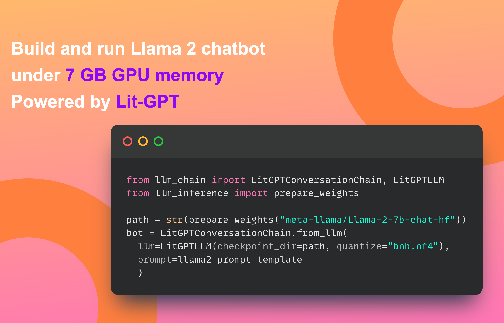

# Large Language Model (LLM) Inference API and Chatbot 🦙


Inference API for LLMs like LLaMA and Falcon powered by Lit-GPT from [Lightning AI](https://lightning.ai)

```
pip install llm-inference
```

### Install from main branch
```bash
pip install git+https://github.com/aniketmaurya/llm-inference.git@main
```

> **Note**: You need to manually install [Lit-GPT](https://github.com/Lightning-AI/lit-gpt) and setup the model weights to use this project.

```
pip install lit_gpt@git+https://github.com/aniketmaurya/install-lit-gpt.git@install
```

## For Inference

```python
from llm_inference import LLMInference, prepare_weights

path = prepare_weights("EleutherAI/pythia-70m")
model = LLMInference(checkpoint_dir=path)

print(model("New York is located in"))
```


## How to use the Chatbot




```python
from llm_chain import LitGPTConversationChain, LitGPTLLM
from llm_inference import prepare_weights

path = str(prepare_weights("meta-llama/Llama-2-7b-chat-hf"))
llm = LitGPTLLM(checkpoint_dir=path, quantize="bnb.nf4")  # 7GB GPU memory
bot = LitGPTConversationChain.from_llm(llm=llm, prompt=llama2_prompt_template)

print(bot.send("hi, what is the capital of France?"))
```

## Launch Chatbot App

<video width="320" height="240" controls>
  <source src="/assets/chatbot-demo.mp4" type="video/mp4">
</video>

**1. Download weights**
```py
from llm_inference import prepare_weights
path = prepare_weights("meta-llama/Llama-2-7b-chat-hf")
```

**2. Launch Gradio App**

```
python examples/chatbot/gradio_demo.py
```
